Criação do ambiente Linux no Virtual box
Na página inicial do virtual box

1. Cricar no botão "novo", informar o nome de "spark",no campo tipo selecionar linux e versão Ubuntu (64 bits) e cricar no notão próximo.

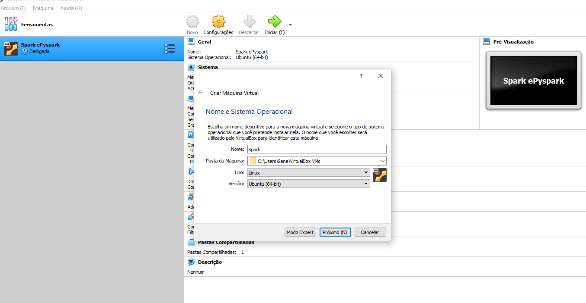

2. Informe o tamnho da memória,vamos colocar 6080.Cricar em próximo
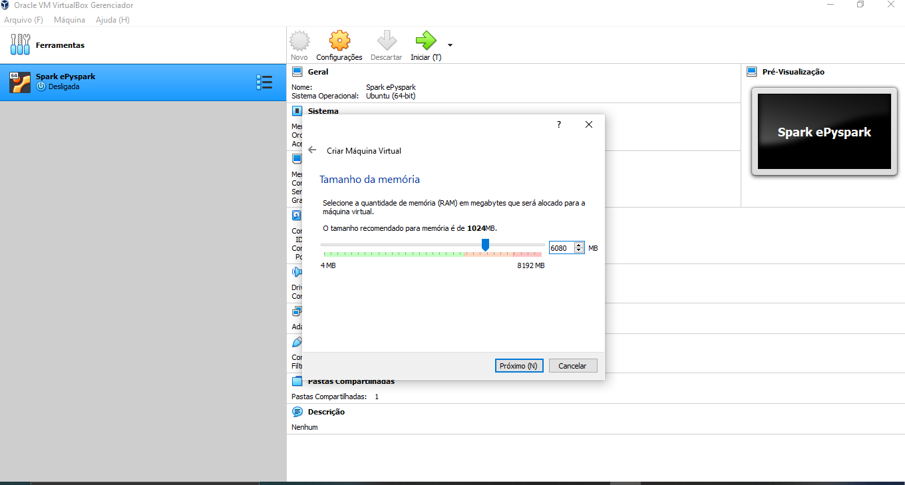

3. Criar o disco virtual, deixar a opção padrão.
Marcar criar um novo disco rigido virtual agora e cricar em criar

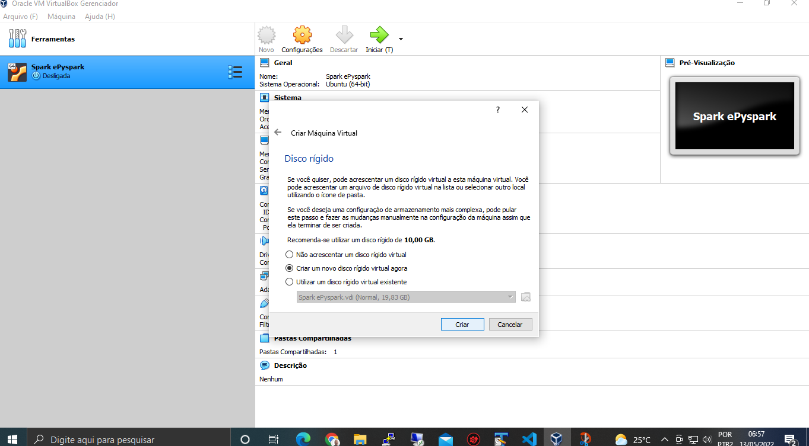

4. O tipo de disco é VDI, confirmar cricando próximo.

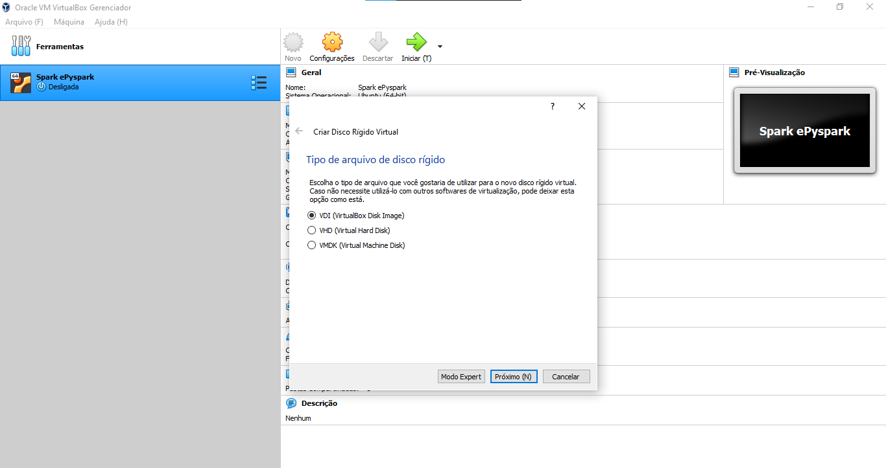

5.  Armazenamento em disco fisíco, escolher o padrão.Dinamicamente alocado e próximo. 

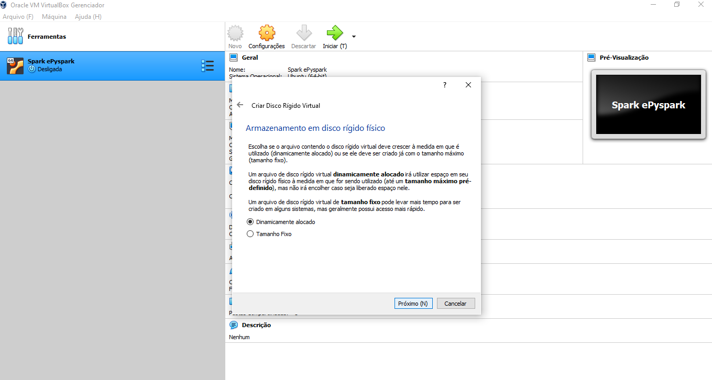

6. É sugerido 10GB de disco rígido, mas coloque 25GB.Cricar em criar.

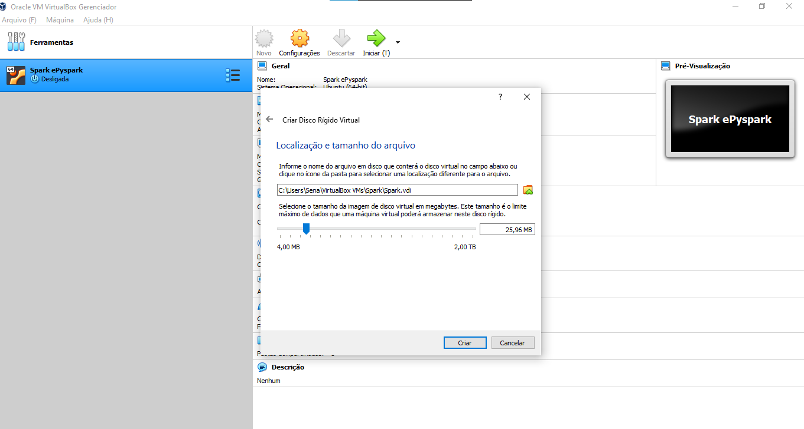

7. Observamos que foi criada nossa nova vm

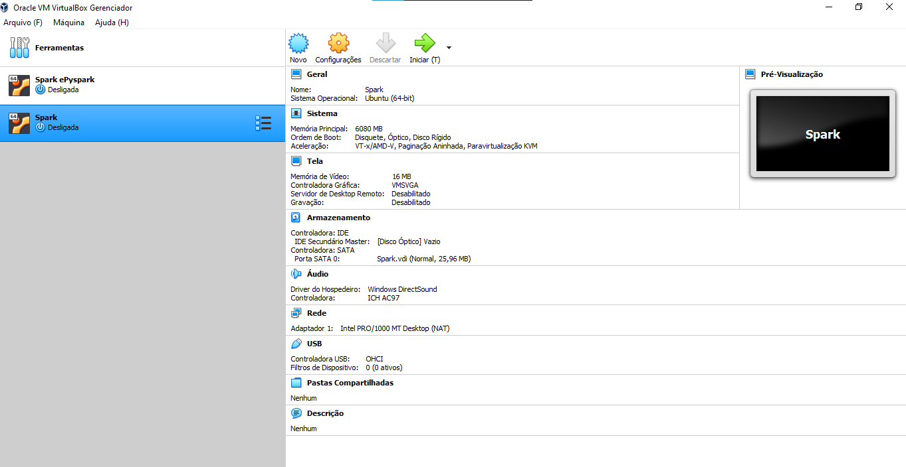

8. Vamos agora cricar em configurações, vamos fazer algumas melhorias.

Em monitor, vamos melhorar a memória de vídeo.Colocando 64, sugerido pelo professor, porém pode ser menor.

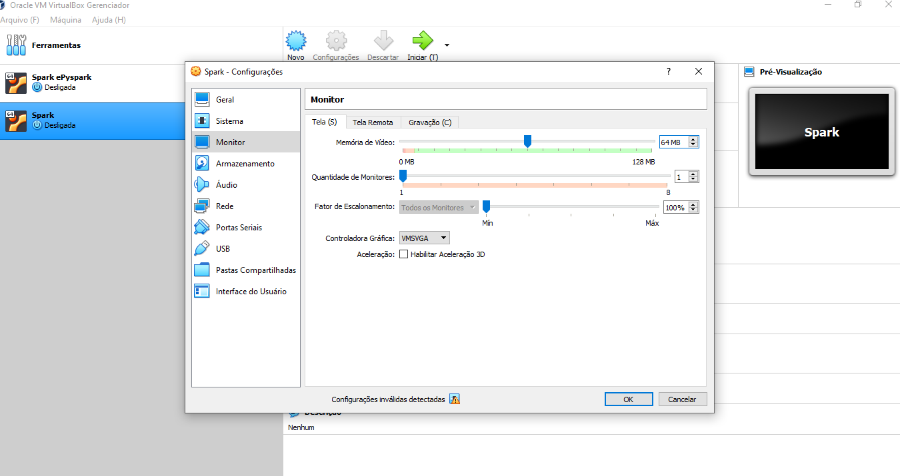

Em Armazenamento, vamos cricar em + na controladora (acrescentar disco rigido) e selecionar a image ISo que foi feita o download anteriormente.
Se já estiver visível basta selecionar, e criar em escolhar.

Caso não esteja crcar em acrescentar, navegar nas pastas e selcecionar no local onde foi baixado.

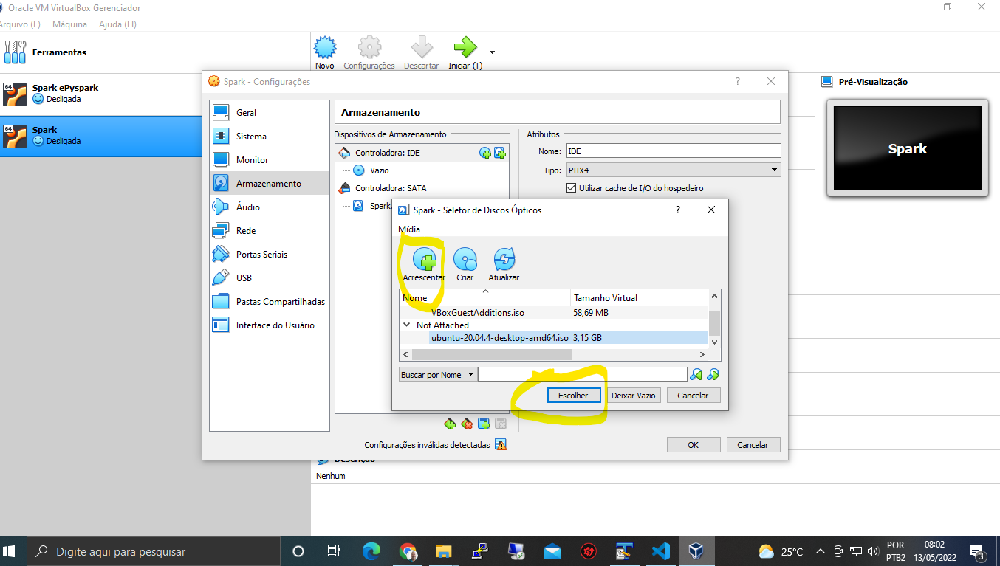

Na controladora vamos escolher a da nossa imagem do S.O.A controlodora "vazio" podemos remover.
Agora damos OK.

Nesse ponto podemo iniciar e ele irá iniciar o sistema pela primeira vez baseado na imagem que instalamos.

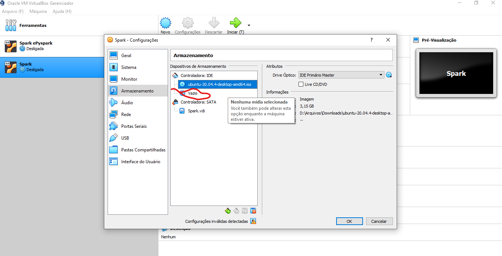

Iniciando o sistema pela primeira vez

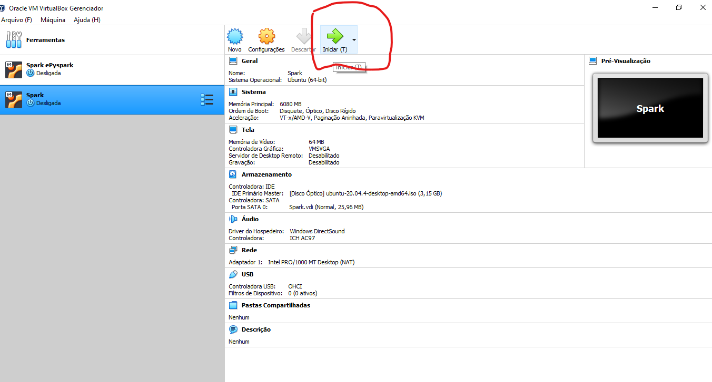

Crique em iniciar.

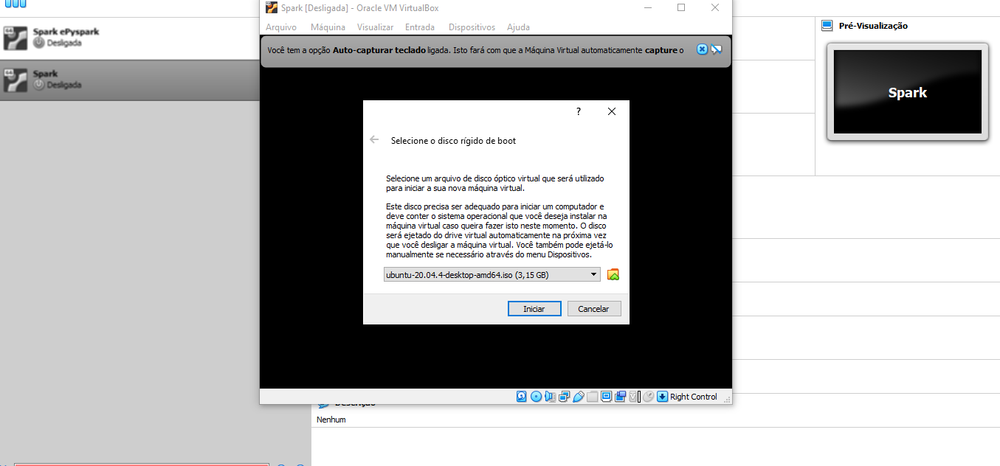

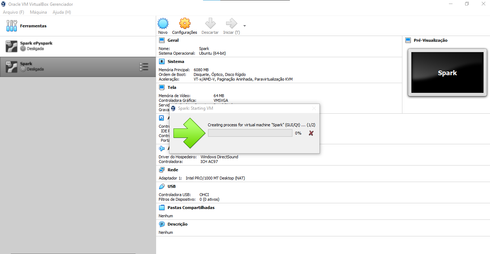

