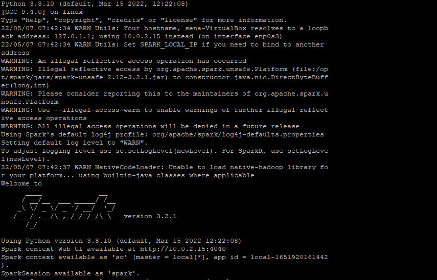
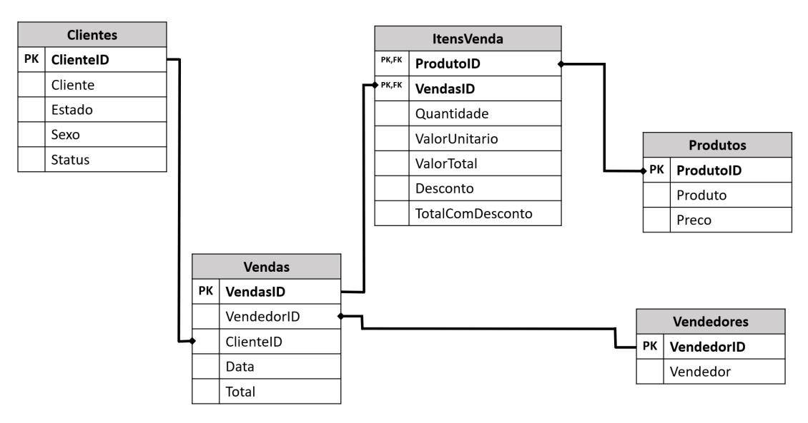

Desafio 1


## No cenário hipotético de uma empresa chamada Ciclismo e Art.
## Atua no ramo de ciclismo, trabalha com 10 produtos e tem no seu quadro funcional 10 vendedores. Atualmente possue 250 clientes, costuma caracterizar os clientes em 3 níveis de fidelização.

## Sendo : Gold,Platinum e Silver.

## Deseja fazer algumas análises para tomada de decisão conforme abaixo.


## 1. Crie uma consulta que mostre, nesta ordem, Cliente, Estados e Status

### Ir para o local onde estão os arquivos
sena@sena-VirtualBox:~/download$ `cd Atividades`

## Verificando o que tem na pasta 
sena@sena-VirtualBox:~/download/Atividades$ `ls -la`

``` 
total 64
drwxrwxr-x 2 sena sena  4096 ago 24  2021 .
drwxrwxr-x 6 sena sena  4096 mai  7 19:57 ..
-rw-rw-r-- 1 sena sena  9311 ago 24  2021 Clientes.parquet
-rw-rw-r-- 1 sena sena 21142 ago 24  2021 ItensVendas.parquet
-rw-rw-r-- 1 sena sena  3490 ago 24  2021 Produtos.parquet
-rw-rw-r-- 1 sena sena 11882 ago 24  2021 Vendas.parquet
-rw-rw-r-- 1 sena sena  2589 ago 24  2021 Vendedores.parquet
```

## *No prompt de comando, chamar o pyspark 

sena@sena-VirtualBox:~/ms-pyspark$ `pyspark`




riamos um Diagrama Relacional, neste caso tem o foco apenas facilitar o entendimento do négocio, mesmo porque dever ser feita as análise usado dataframe.  

  


# Resposta: Iremos lê os dados e criar 2 dataframes para armazenar os dados. 

`clientes_df =  spark.read.format("parquet").load("/home/sena/download/Atividades/Clientes.parquet")`

`vendas_df =  spark.read.format("parquet").load("/home/sena/download/Atividades/Vendas.parquet")`


## ⚠ Dica: 

### Vamos importar a biblioteca sql para facilitar as instruções sql.  

`from pyspark.sql import functions as Func`

 `clientes_df.select("Cliente","Estado","Status").show()`

```
Output 
+--------------------+------+--------+
|             Cliente|Estado|  Status|
+--------------------+------+--------+
|Adelina Buenaventura|    RJ|  Silver|
|        Adelino Gago|    RJ|  Silver|
|     Adolfo Patrício|    PE|  Silver|
|    Adriana Guedelha|    RO|Platinum|
|       Adélio Lisboa|    SE|  Silver|
|       Adérito Bahía|    MA|  Silver|
|       Aida Dorneles|    RN|  Silver|
|   Alarico Quinterno|    AC|  Silver|
|    Alberto Cezimbra|    AM|  Silver|
|    Alberto Monsanto|    RN|    Gold|
|       Albino Canela|    AC|  Silver|
|     Alceste Varanda|    RR|  Silver|
|  Alcides Carvalhais|    RO|  Silver|
|        Aldo Martins|    GO|  Silver|
|   Alexandra Tabares|    MG|  Silver|
|      Alfredo Cotrim|    SC|  Silver|
|     Almeno Figueira|    SC|  Silver|
|      Alvito Peralta|    AM|  Silver|
|     Amadeu Martinho|    RN|  Silver|
|      Amélia Estévez|    PE|  Silver|
+--------------------+------+--------+
```

## 2. Crie uma consulta que mostre apenas os clientes do Status “platinum” e “gold”


# Resposta:

`clientes_df.select("ClienteId","Cliente","Status").where((Func.col("Status") == "Platinum") |  (Func.col("Status")== "Gold") ).show() `

```
Output
+---------+-------------------+--------+
|ClienteId|            Cliente|  Status|
+---------+-------------------+--------+
|        4|   Adriana Guedelha|Platinum|
|       10|   Alberto Monsanto|    Gold|
|       28|      Anna Carvajal|    Gold|
|       49|      Bento Quintão|    Gold|
|       68|      Carminda Dias|    Gold|
|       83|      Cláudio Jorge|    Gold|
|      121|    Dionísio Saltão|    Gold|
|      166|   Firmino Meireles|    Gold|
|      170|      Flor Vilanova|Platinum|
|      220|Honorina Villaverde|    Gold|
|      230|    Ibijara Botelho|Platinum|
|      237|  Iracema Rodríguez|    Gold|
|      247|         Joana Ataí|Platinum|
+---------+-------------------+--------+
```

### Melhorando a resposta, ordenando por status
` clientes_df.select("ClienteId","Cliente","Status").where((Func.col("Status") == "Platinum") |  (Func.col("Status")== "Gold") ).orderBy(Func.col("Status")).show()  `
```
+---------+-------------------+--------+
|ClienteId|            Cliente|  Status|
+---------+-------------------+--------+
|       68|      Carminda Dias|    Gold|
|       10|   Alberto Monsanto|    Gold|
|      166|   Firmino Meireles|    Gold|
|      220|Honorina Villaverde|    Gold|
|      237|  Iracema Rodríguez|    Gold|
|       83|      Cláudio Jorge|    Gold|
|       28|      Anna Carvajal|    Gold|
|      121|    Dionísio Saltão|    Gold|
|       49|      Bento Quintão|    Gold|
|        4|   Adriana Guedelha|Platinum|
|      170|      Flor Vilanova|Platinum|
|      230|    Ibijara Botelho|Platinum|
|      247|         Joana Ataí|Platinum|
+---------+-------------------+--------+

``` 

## 3. Demostre quanto cada Status de Clientes representa em vendas?

## Lendo o arquivo de vendas 
`vendas_df = spark.read.format("parquet").load("/home/sena/download/Atividades/Vendas.parquet")`

`vendas_df.show()`

```
Output 
+--------+----------+---------+---------+--------+
|VendasID|VendedorID|ClienteID|     Data|   Total|
+--------+----------+---------+---------+--------+
|       1|         1|       91| 1/1/2019|  8053.6|
|       2|         6|      185| 1/1/2020|   150.4|
|       3|         7|       31| 2/1/2020|  6087.0|
|       4|         5|       31| 2/1/2019| 13828.6|
|       5|         5|       31| 3/1/2018|26096.66|
|       6|         5|       31| 4/1/2020| 18402.0|
|       7|         5|       31| 6/1/2019|  7524.2|
|       8|         5|      186| 6/1/2019| 12036.6|
|       9|         7|       91| 6/1/2020| 2804.75|
|      10|         2|      202| 6/1/2020|  8852.0|
|      11|         7|       58| 8/1/2019|16545.25|
|      12|         7|       58| 9/1/2018|11411.88|
|      13|         7|       58|10/1/2019| 15829.7|
|      14|         3|      249|12/1/2020| 6154.36|
|      15|         4|      249|12/1/2018| 3255.08|
|      16|         7|      192|13/1/2020| 2901.25|
|      17|         2|       79|13/1/2019| 15829.7|
|      18|        10|       79|14/1/2019|16996.36|
|      19|        10|      191|14/1/2019|   155.0|
|      20|         9|      218|15/1/2018|  131.75|
+--------+----------+---------+---------+--------+
```
## Listando 2 registros de vendas
`vendas_df.show(2)`

```
Ouput
+--------+----------+---------+--------+------+
|VendasID|VendedorID|ClienteID|    Data| Total|
+--------+----------+---------+--------+------+
|       1|         1|       91|1/1/2019|8053.6|
|       2|         6|      185|1/1/2020| 150.4|
+--------+----------+---------+--------+------+
only showing top 2 rows
```

## Listando 2 registros de clientes

`clientes_df.show(2)`

```
Output

+---------+--------------------+------+------+------+
|ClienteID|             Cliente|Estado|Genero|Status|
+---------+--------------------+------+------+------+
|        1|Adelina Buenaventura|    RJ|     M|Silver|
|        2|        Adelino Gago|    RJ|     M|Silver|
+---------+--------------------+------+------+------+
only showing top 2 rows

```
## Fazendo o join entre clientes e vendas, somando o total e agrupando por status 

`from pyspark.sql.functions import sum as SUM`

`vendas_por_status = vendas_df.join(clientes_df,vendas_df.ClienteID == clientes_df.ClienteID).groupBy(clientes_df.Status).agg(SUM("Total")).orderBy(Func.col("sum(Total)").desc())show()`

## Resposta atividade 3:
Sem ordenar 
`vendas_df.join(clientes_df,vendas_df.ClienteID == clientes_df.ClienteID).groupBy(clientes_df.Status).agg(SUM("Total")).show()`

``` 
+--------+------------------+
|  Status|        sum(Total)|
+--------+------------------+
|Platinum|          12584.68|
|  Silver|        3014291.36|
|    Gold|27286.690000000002|
+--------+------------------+
``` 

## Ordenado em decrescente e atribuindo para um daframe Atividade3

`Atividade3 =vendas_df.join(clientes_df,vendas_df.ClienteID == clientes_df.ClienteID).groupBy(clientes_df.Status).agg(SUM("Total")).orderBy(Func.col("sum(Total)").desc())`

`Atividade3.show()`

``` 
Output
+--------+------------------+
|  Status|        sum(Total)|
+--------+------------------+
|  Silver|        3014291.36|
|    Gold|27286.690000000002|
|Platinum|          12584.68|
+--------+------------------+
``` 
