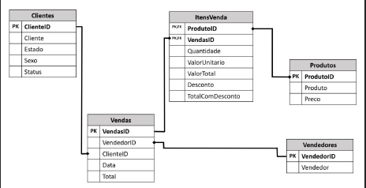

  

# Desafio 2 - Banco de dados e persistência das tabelas

1.Crie um banco de dados no DW do Spark
chamado VendasVarejo, e persista todas as
tabelas neste banco de dados.

2.Crie uma consulta que mostre de cada item
vendido: Nome do Cliente, Data da Venda,
Produto, Vendedor e Valor Total do item.

# RESPOSTAS 